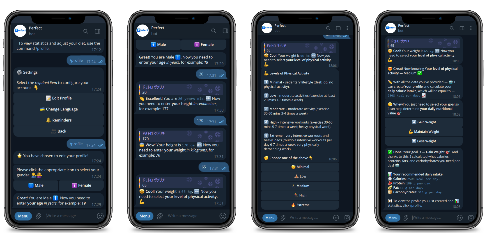
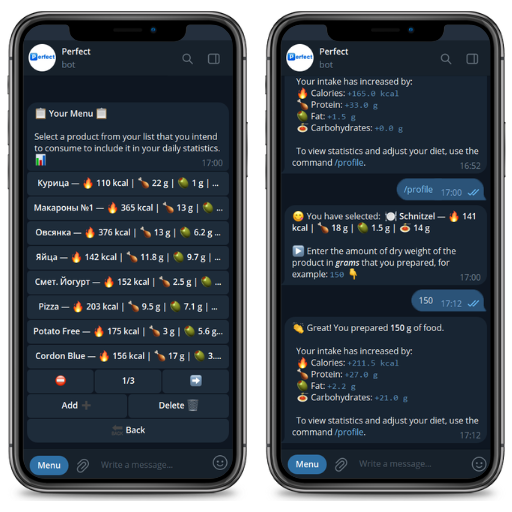
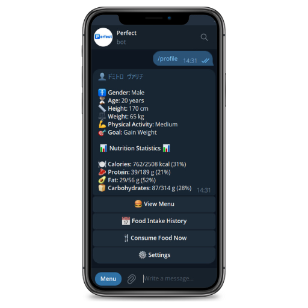

# 🅿️ Perfect Bot

<p align="center">
  
</p>

[Perfect Bot](https://t.me/your_perfect_bot) is your personal assistant for tracking nutrition and achieving healthy lifestyle goals in [Telegram](https://web.telegram.org/). It is designed for those who want to easily manage their diet, monitor their intake of calories, proteins, fats, and carbohydrates, and achieve their fitness goals.

## 🛠️ Technologies
<p align="center">       </p>

## 🚀 Futures

- **🧾 Create a Personal Profile**

    On the first launch, the bot prompts the user to fill out a short profile: gender, age, height, weight, physical activity level, and goal (lose weight, maintain, or gain mass). Based on this information, it calculates a personalized daily intake of calories, proteins, fats, and carbohydrates.

  <p align="center">
      
  </p>


- 🍱 **User-Defined Product Menu**

    Users can create a list of their own food items by specifying the calories, proteins, fats, and carbohydrates per 100 grams. These items can then be quickly added to the daily log — just enter the consumed amount, and the bot will automatically calculate the daily and weekly nutrition stats.

  <p align="center">
      
  </p>


- 👤 **Profile and Daily Stats**

    The bot displays the user's profile along with the current nutrition progress for the day.

    <p align="center">
      

- ⏱ **Quick Food Entry**

    Users can instantly log a meal by entering the calories, proteins, fats, and carbs per 100g and the amount consumed — without needing to add the product to the menu first.

- 🌐 **Multilingual Support**
    
    The interface is available in both English and Ukrainian.

- 🧩 **Aiogram Bot Template**

    This repository can serve as a solid foundation for building other Telegram bots using the `aiogram` framework.

## ⚙️ Install

1. **Clone the repository:**

```bash
git clone https://github.com/dmytro-varich/Perfect-bot.git
cd Perfect-bot
```

2. **Create a virtual environment and install dependencies:**

```bash
python -m venv venv
source venv/bin/activate  # For Linux/macOS
# OR
venv\Scripts\activate     # For Windows

pip install -r requirements.txt
```

3. **Create a `.env` file** in the project root with the following content:

```env
TOKEN='your-telegram-bot-token'
```

4. **Run the bot:**

```bash
python main.py
```

## 🟢 Project Status
The project is **not under active development**, but it is running on a [server](https://cloud.tuke.sk/) and remains available for use for an indefinite period

Further development and new features may be added in the future depending on user interest and feedback.

## 🤝 Contributing
I will be glad to pull-requests, suggestions and bugreports!
To contribute:

1. Fork the repository
2. Create a new branch (`git checkout -b feature/your-feature`)
3. Make your changes
4. Submit a pull request

<details>
  <summary><strong>Feature Ideas</strong></summary>

  <br>

  | Name                          | Description                                                                                                                                                                                                        |
  | ----------------------------- | ------------------------------------------------------------------------------------------------------------------------------------------------------------------------------------------------------------------ |
  | **Meal Notifications**        | Add a feature that allows users to set specific times for meal reminders. The bot would send a notification at those times to help users stay on track with their nutrition plan.                                  |
  | **AI-based Meal Suggestions** | Implement a system using AI or rule-based logic to suggest food items that can help the user reach their daily macronutrient goals. Based on the current intake, the bot would recommend what and how much to eat. |

</details>

## 🧑🏻 Author
Dmytro Varich is the creator of this telegram bot. You can learn more about his projects on his personal [Telegram channel](https://t.me/varich_channel), as well as connect with him via [LinkedIn](https://www.linkedin.com/in/dmytro-varich/) and [Email](<varich.it@gmail.com>).
